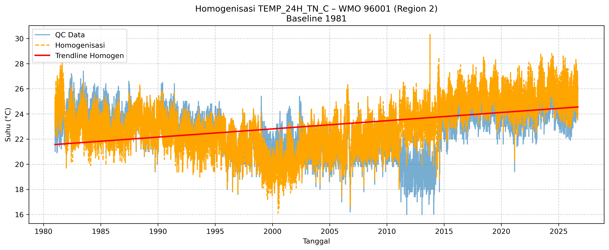

# Dataset Perubahan Iklim Terstandarisasi

Repositori ini berisikan informasi terkait denga proses quality control dan di homogenisasi dataaset FKLIM71 yang diambil dari seluruh stasiun pengamatan BMKG untuk menunjang keperluan analisa iklim. Dataset ini nantinya akan disimpan pada database perubabahan iklim yang dikelola oleh Bidang Analisis Perubahan Iklim BMKG, Kedeputian Bidang Klimatologi. Untuk akses data dapat menghubungi kotak terlampir.


## 📋 Table of Contents
- [Overview](#overview)
- [Features](#features)
- [Installation](#installation)
- [Data](#data)
- [Usage](#usage)
- [Methodology](#methodology)
- [Results](#results)
- [Dependencies](#dependencies)
- [Contributing](#contributing)
- [License](#license)
- [Citation](#citation)
- [Contact](#contact)

## Overview
> Project ini menggunakan metode QC yang dikembangan internal Tim BMKG dan motode PHA untuk homogenisasi dataset.

## Features
- ✅ Dataset terdiri dari parameter curah hujan dan suhu 
- ✅ Dataset curah hujan dan suhu yang telah ter QC
- ✅ Dataset suhu yang telah di homogenisasi
- ✅ API khusus untuk akses dataset
- ✅ Mendukung analisa iklim jangka panjang
- ✅ Perhitungan anomali suhu bulanan yang terstandarisasi

## Installation
### Prerequisites
- Python 3.10+
- Conda (recommended)

### Setup
```bash
# Clone repository
git clone https://github.com/username/high-res-downscaling-cmip6.git
cd high-res-downscaling-cmip6

# Create containers
cd containers
apptainer build smong-tensorflow-bcsd.sif smong-tensorflow.def

```

## Data
| Dataset | Sumber | Resolusi | Periode |
|---------|--------|------------|--------|
| FKLIM71 | BMKG | Harian | 1981–Now |

> **Note:** Data tidak disertakan dalam repo ini karena ukurannya besar.

## Methodology
Penjelasan metode yang dipakai untuk Quality Controll (QC):
- **Duplicate Check:** Menghapus data duplicat
- **Availability Check:** Hitung persentase ketersediaan data per stasiun untuk 2 baseline (1981-2010 dan 1991-2020). Stasiun dengan data < 80% di-exclude dari baseline tersebut. Untuk data yang dibawah 80% akan dieliminasi dan tidak di ikutsertakan dalam analisa iklim jangka panjang.
- **Duplicate Runs Check:** Menandai (bukan menghapus) nilai yang berulang identik ≥4-5 hari berturut-turut sebagai NaN — indikasi sensor macet/stuck. Khusus curah hujan, nilai 0 dikecualikan (karena hari kering berturut-turut itu valid, bukan anomali).
    > ⚠️ Catatan: ada inkonsistensi kecil — komentar bilang "≥5 hari" tapi kode memanggil min_run_length=4.

- **Consistency Check:** Cek logika TN ≤ TAVG ≤ TX. Kalau melanggar, TAVG di-NaN-kan lalu diinterpolasi linear, atau diestimasi dari (TN+TX)/2 kalau interpolasi gagal.
- **Range Check:** Validasi terhadap PHYSICAL_BOUNDS. Nilai di luar batas fisik di-NaN-kan, lalu interpolasi (kecuali rainfall, yang tidak diinterpolasi — hanya dibuang).
- **Abrupt Change Adjustment:** Deteksi lompatan nilai antar hari berurutan > threshold (2.5°C), lalu NaN-kan dan interpolasi. Tidak berlaku untuk rainfall (curah hujan memang wajar berubah drastis).

Penjelasan metode yang dipakai untuk Homogenisasi:
- **PCA + K-Means Clustering:** 
    1. **Input & Filtering:** Untuk tiap parameter (suhu/hujan) dan tiap baseline (1981/1991), sistem akan mengambil stasiun yang lolos QC dan memiliki ketersediaan data ≥80%.
    2. **Agregasi:** Data harian dirata-ratakan per stasiun (*mean* sepanjang periode) untuk menghasilkan satu nilai representatif per stasiun.
    3. **Feature Engineering:** Membentuk fitur untuk *clustering* yaitu `[LATITUDE, LONGITUDE, nilai_parameter_rata-rata]`. Region dibentuk berdasarkan kombinasi lokasi geografis dan karakteristik iklim rata-rata, bukan geografis murni.
    4. **PCA (Dimensionality Reduction):** Reduksi 3 fitur menjadi 2 komponen utama (PC1, PC2). *Explained variance* juga dicatat untuk transparansi seberapa banyak informasi yang terwakili.
    5. **K-Means Clustering:** *Clustering* dilakukan di ruang PCA (2D) dengan jumlah *cluster* yang di-*hardcode*: 
        * Suhu = 4 region
        * Curah Hujan = 6 region
    6. **Output & Visualisasi:** Tiap stas

- **Reference-based Anomaly + Changepoint Detection (PELT):** Ini adalah pendekatan yang mirip prinsip PHA (pairwise comparison dengan tetangga) tapi implementasinya disederhanakan — bukan PHA asli dari NOAA.
    1. **Pencarian Tetangga (*Neighbor Search*):** Mengambil stasiun-stasiun lain yang berada dalam region yang sama (hasil dari script 02).
    2. **Seleksi Tetangga Terbaik:** Dari kandidat tetangga, menghitung korelasi (`corrwith`) dengan stasiun target, lalu memilih 5 tetangga dengan korelasi tertinggi.
    3. **Pembangunan *Reference Series*:** Menghitung rata-rata dari 5 tetangga terbaik untuk menghasilkan `series_ref`.
    4. **Perhitungan *Anomaly*:** Menghitung `anomaly = target - reference`, menghasilkan deret selisih (prinsip yang sama dengan PHA *pairwise difference*).
    5. **Deteksi *Breakpoint*:**
    - **Resampling:** *Anomaly* harian di-*resample* menjadi bulanan (`resample('ME').mean()`).
    - **Changepoint Detection:** Menggunakan library `ruptures` dengan algoritma PELT (*Pruned Exact Linear Time*) dan model "rbf" untuk mendeteksi *changepoint* pada deret anomaly bulanan.
    6. **Koreksi *Offset*:**
    - **FORCE-EARLY:** Untuk segmen sebelum/sesudah *breakpoint* pertama, dihitung selisih mean-nya. Jika offset ≥ `THRESHOLD_FORCE` (0.5°C), koreksi dipaksakan.
    - **SEGMENT Adjustment:** Untuk *breakpoint* berikutnya, tiap segmen disesuaikan agar sejalan dengan mean segmen setelahnya.
    7. **Output & Visualisasi:** Menambahkan kolom baru `HOMO_{param}` (data setelah homogenisasi), disimpan per stasiun, dilengkapi plot perbandingan QC vs Homogenized beserta *trendline*.


## Results
Contoh output/visualisasi (bisa sertakan gambar):

```markdown

```


## License
Project ini menggunakan lisensi [MIT License](LICENSE).


## Contact
**Firmansyah** – firmansyah.02@bmkg.go.id  
Project Link: [https://github.com/firmanshhh/Statistical_Downscalling_HighRes_CMIP6_Dataset_Using_XCLIM](https://github.com/firmanshhh/Statistical_Downscalling_HighRes_CMIP6_Dataset_Using_XCLIM)